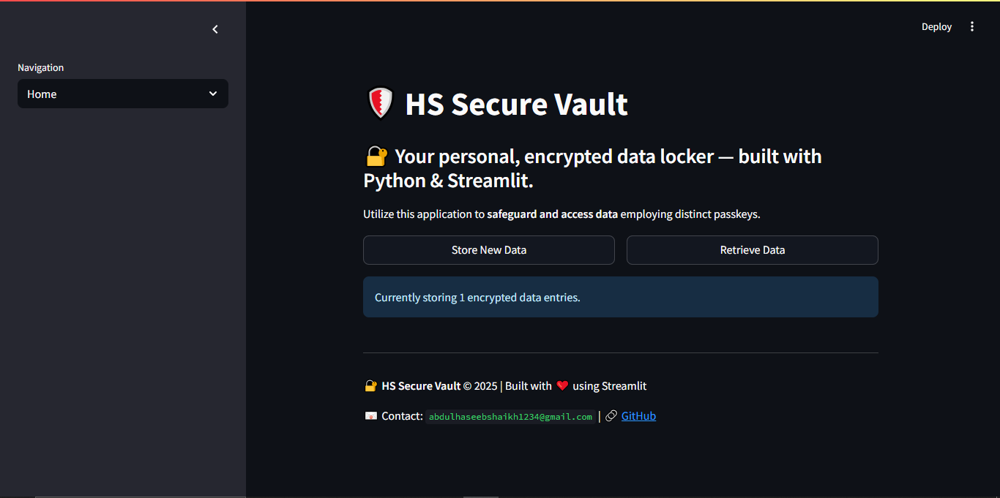
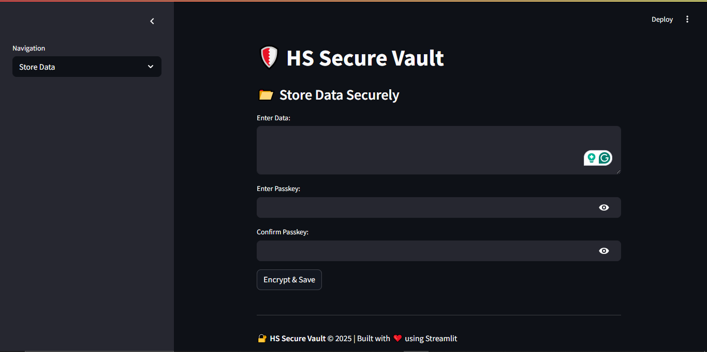
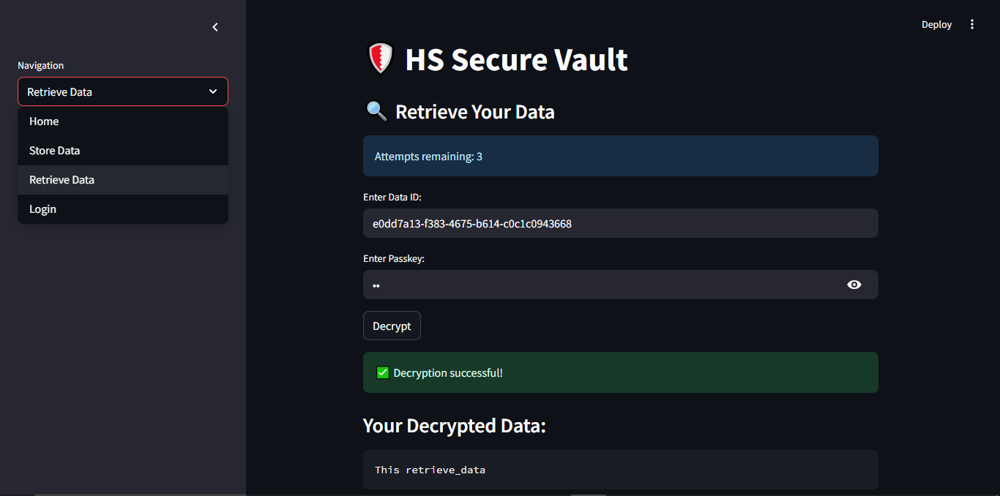

# Assignament_05_secure_data_encryption

# 🛡️ HS Secure Vault

A **Streamlit-powered** web application that allows users to **securely store and retrieve sensitive data** using encryption and passkeys. Built as an educational project to demonstrate real-world encryption concepts using Python and the `cryptography` library.

---

## 📌 Features

- 🔐 **Encrypt & store** any text data using a custom passkey.
- 🔓 **Secure retrieval** of data using proper passkey authentication.
- 🔐 **Hashing and Encryption** with SHA256 and Fernet (AES).
- 🚫 **Brute-force protection** with failed attempt limit.
- 🔁 **Reauthorization mechanism** after 3 failed attempts.
- 📋 Simple & clean **user interface** with Streamlit.

---


## 📸 UI Preview

### 🏠 Home Page


### 🔐 Store Data Page


### 🔍 Retrieve Data Page


---

## 👨‍💻 Author

### Abdul Haseeb Shaikh

🎓 Python Developer & Frontend Engineer  
💼 Passionate about Web Security, AI, and Real-World Solutions  
📫 **Email:** [abdulhaseebshaikh1234@gmail.com](mailto:abdulhaseebshaikh1234@gmail.com)  
📱 **Phone:** +92-318-6835430  
🐙 **GitHub:** [@abdulhaseebdev](https://github.com/Abdul-Haseeb360)  


---

## ⚙️ Technologies Used

| Technology     | Description                          |
|----------------|--------------------------------------|
| Python 3.x     | Core programming language            |
| Streamlit      | UI and frontend framework            |
| Cryptography   | Secure encryption & decryption       |
| Hashlib        | Passkey hashing (SHA256)             |
| UUID           | Unique data ID generation            |
| Time           | Timeout between login attempts       |

---

## 🚀 Getting Started

### ✅ Prerequisites

Install Python and then the following libraries:

```bash
pip install streamlit cryptography
```

